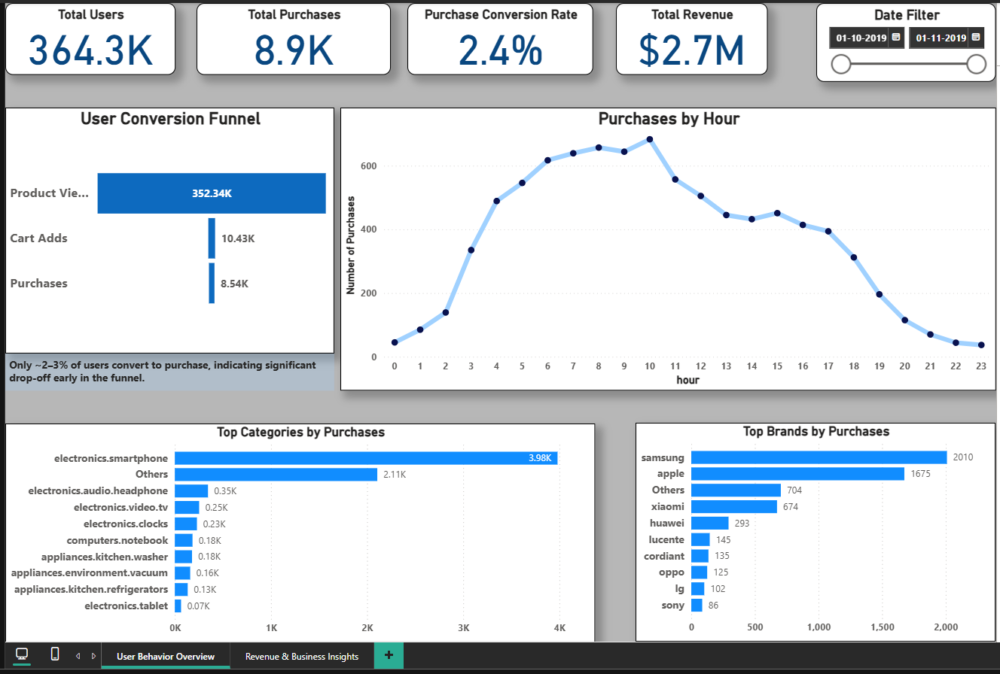
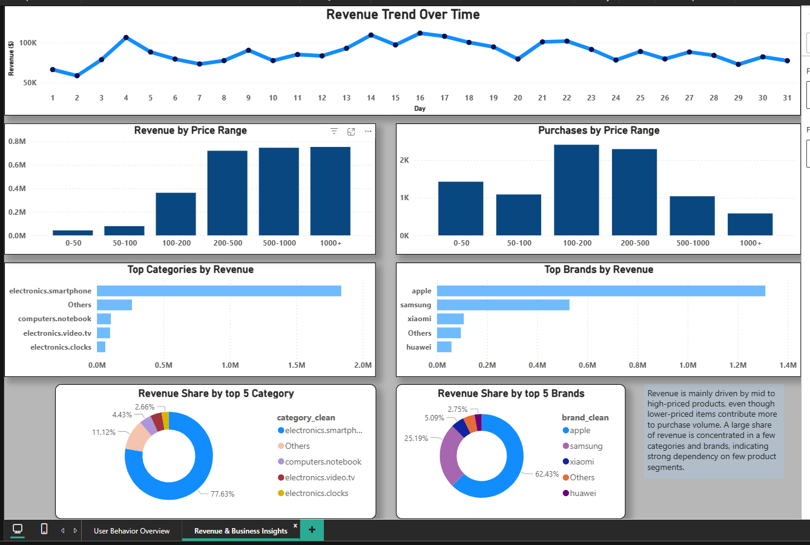

# E-Commerce Funnel Analytics: Conversion, Behavior & Revenue

## Problem Statement

An e-commerce platform generates a high volume of user traffic, but only a small percentage of users convert into customers. Understanding where users drop off in the purchasing journey and what factors influence buying behavior is critical for improving conversion rates and revenue.

This project analyzes user interactions across the product funnel to identify drop-off points, understand purchasing behavior, and uncover key revenue drivers.

## Objective

The objective of this project is to analyze user behavior across the e-commerce funnel and identify key factors affecting conversion and revenue. The analysis focuses on user journeys, session behavior, product performance, cohort behaviour and pricing patterns to derive actionable business insights.

## Dataset

Dataset is not included due to size constraints.  
You can download it from Kaggle
- Source: Kaggle (E-commerce Behavior Dataset)
- Link: https://www.kaggle.com/datasets/mkechinov/ecommerce-behavior-data-from-multi-category-store/data/code
- Data Type: User event-level data (views, cart, purchase)
- Size: 42 million rows
- Key Features:
  - event_time, event_type
  - product_id, category_id, category_code, brand
  - price, user_id, user_session

A sampled dataset was used to ensure efficient analysis while maintaining realistic behavioral patterns.

## Tools & Technologies

- Python (Pandas, NumPy) → Data cleaning & analysis
- SQL (SQLite) → Data querying & aggregation
- Power BI → Dashboard & visualization

## Project Workflow

1. Data Cleaning & Feature Engineering  
   - Processed raw event data and created time-based and price-based features  

2. Funnel Analysis  
   - Analyzed user journey from view → cart → purchase  
   - Identified key drop-off points  

3. Behavioral Analysis  
   - Studied session patterns, time-to-purchase, and hourly activity trends  

4. Revenue Analysis  
   - Evaluated price sensitivity, category performance, and brand contribution  

5. Advanced User Analysis  
   - Performed cohort retention analysis, explored user segmentation, repeat behavior, and retention patterns  

6. SQL-Based Analysis  
   - Validated key metrics using structured queries  

7. Dashboard Development  
   - Built an interactive Power BI dashboard for business insights
  

## Key Insights

- Most users interact with the platform only at the browsing stage, and only a small percentage (~ 2-3%) move forward to purchase, indicating a major drop-off early in the funnel.
- Only a small fraction of users who view products actually complete a purchase, showing a clear gap between interest and actual buying behavior.
- Users spend a short time (~ 1-2 minutes) in each session, and most purchases happen quickly, suggesting that buying decisions are usually made within the same session rather than after long consideration.¶
- Electronics categories, especially smartphones and headphones, generate both high traffic and strong conversions, making them key drivers of platform performance.
- Mid-priced products tend to convert better than very cheap ones, indicating that users focus more on value rather than just low price.
- Most of the revenue comes from mid to high-priced products, showing that higher-value items play an important role in overall business growth.
- Purchase activity is highest during morning to early afternoon hours, especially around 10 AM, suggesting that users are more likely to buy during this time.
- Brands like Apple and Samsung drive strong traffic as well as conversions, indicating high customer trust and brand preference.
- Most users do not return after their first interaction, and only a small percentage (~ 3-4%) become repeat buyers, highlighting low user retention.
- A large number of users only browse products without taking further action, while some users add items to the cart but do not complete the purchase, indicating possible friction in the buying process.

## Business Recommendations

- Improve product pages and overall user experience to encourage users to move beyond browsing, as the biggest drop-off happens at this stage.
- Simplify the checkout process to reduce cart abandonment and make the purchase journey smoother.
- Focus marketing efforts on high-performing categories like electronics, which already show strong conversion potential.
- Promote mid-range and high-value products, as they contribute significantly to both conversions and revenue.
- Run targeted campaigns during peak hours (morning to early afternoon) to maximize purchase activity.
- Introduce strategies to improve retention, such as personalized recommendations, offers, and reminders, since most users do not return.
- Target users who abandon carts with discounts or follow-up notifications to recover potential lost sales.
- Strengthen partnerships or promotions with high-performing brands like Apple and Samsung to further boost conversions.

## Dashboard Overview

The Power BI dashboard is divided into two sections:

### User Behavior Overview
- Funnel conversion analysis
- User activity trends
- Category & brand performance

### Revenue & Business Insights
- Revenue trends over time
- Price segment analysis
- Revenue contribution by category & brand

Includes interactive filters for dynamic exploration.

## Dashboard Preview

### User Behavior Overview

### Revenue & Business Insights

## How to Run

1. Clone the repository  
2. Open the Jupyter Notebook for analysis  
3. Run SQL queries from the /sql folder  
4. Open Power BI dashboard (.pbix file)
